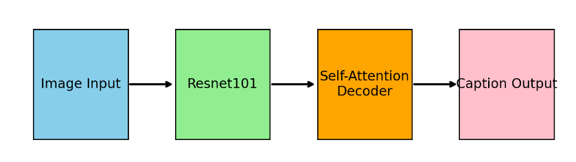
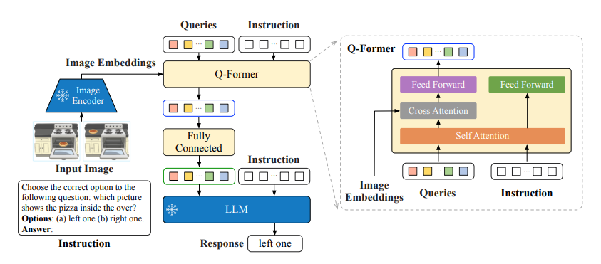
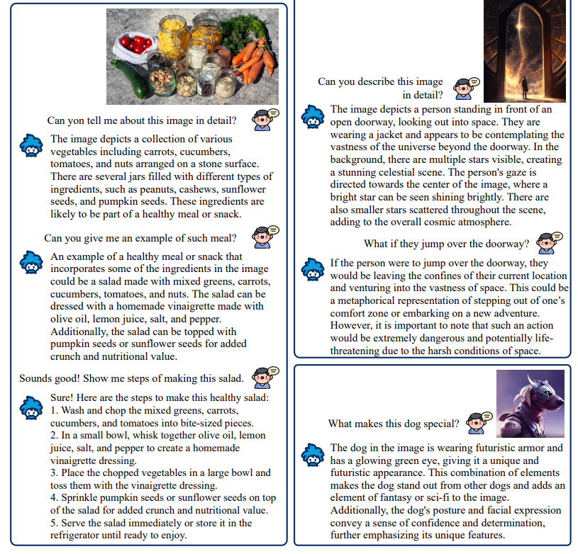

# 1. 项目结构

理论上，我们的项目结构应该像这样：

```
Project
├── LAVIS: git submodule
├── code
|   ├── assets
|   ├── base-CNN+RNN-ALL.ipynb
|   ├── base-SelfAttention.ipynb
|   ├── bonus1-SelfAttnBased-RL-loss_fn.ipynb
|   ├── bonus3-LLM_based-dataset-rebuild.ipynb
|   ├── bonus4-Retrain.ipynb
| 	└── prepare.sh
|
├── dataset
|   ├── deepfasion-multimodel
|   |   ├── images
|   |   |   └── MEN-Denim-id_00000080-01_7_additional.jpg
|   |   ├── test_captions.json
|   |   └── train_captions.json
|   |
|   └── fashion-new
|		└── images-raw
|			└── 男士图像 COZY_168easdasfsdf89455165465.jpg
|
└── output
    ├── model_ckpt
    └── vicuna-7b-1.1
```

路径说明：

+ code路径主要存放所有的notebook代码
  + `base-CNN+RNN-ALL.ipynb`是CNN+GRU的任务代码
  + `base-SelfAttention.ipynb`是网格/区域表示+自注意力的任务实现代码
  + `bonus1-SelfAttnBased-RL-loss_fn.ipynb`是附加题一：使用强化学习训练损失函数，直接优化指标的任务实现代码
  + `bonus3-LLM_based-dataset-rebuild.ipynb`是附加题三：使用我们的模型与大模型重构数据集的代码，数据集选用老师给出的新数据集。（`男士服饰 COZY`）
  + `bonus4-Retrain.ipynb`是附加题四：使用新构建的数据集重新进行训练的代码
+ dataset路径主要存放数据集
  + `deepfashion-multimodel`是原数据集，直接把原数据集直接替换这个文件夹即可。具体的文件分布可以看上面的详细内容。
  + `fashion-new`存放的是老师的数据集，**请按照范例，把压缩文件中的所有图像解压到`images-raw`路径下面**，才可以执行后面的代码。
+ output路径主要存放模型的权重，包括**训练的权重**和**大模型的权重**
  + `model_ckpt`用于保存模型训练的权重文件，在训练过程中会自动创建文件夹进行保存。预计会创建如下文件夹：
    + cnngru
    + attn
    + attn_rl
    + attn_rl_rebuild
  + `vicuna-7b-1.1`用于存放vicuna-7B-v1.1的权重文件。（大约14G左右）


# 2. 代码运行方案与注意事项

## 2.1 环境部署方案

jupyter notebook文件已经尽可能地减轻了部署环境的负担，但是仍有一系列注意事项（由网络问题引起）

1. 中途**可能**会确实两个nltk的包，需要手动下载：`punkt`和`wordnet`，说“可能”是因为你的python环境可能已经预先下载好了这两个所需要的包。如果缺失的话，使用python代码：

   ```python
   nltk.download("punkt")
   nltk.download("wordnet")
   ```

   进行下载。

   不过在下载过程中，因为nltk服务器的问题，可能会一直卡住，这个时候，需要你**手动下载**这两个包，并且拷贝到`/root/nltk_data`的位置。

2. 中途在运行`bonus3-LLM_based-dataset-rebuild.ipynb`的时候，因为会使用到外链的库LAVIS，也就是要使用`instructBlip`模型，它的代码底层可能会用到huggingface，而国内的平台无法访问huggingface（已经尝试多种办法无果）。这个时候可能需要手动下载`bert-base-uncased`的模型到本地，然后去修改LAVIS的代码（到时候会通过`pip install -e .`安装，所以在本地修改代码也生效）（在一些`.from_pretrained()`函数中）：

   ```python
   BertxxxModel.from_pretrained("bert-base-uncased")
   ```

   可能要改为：

   ```python
   BertxxxModel.from_pretrained("<path/to/your/local/bert-base-uncased>")
   ```

   才能成功运行`instructBlip`模型。

3. 因为使用LAVIS库，对torch版本要求较为严格。**要求你的torch版本与你的cuda版本必须一致**，比如说你的cuda是12.1，就不能使用`torch2.1.0-cu118`，而是要升级。如果你的CUDA Version和你的torch安装版本冲突的话，可能不会成功运行代码。


## 2.2 运行prepare.sh

在这里我们已经准备好了一份bash脚本，应对我们需要的安装包的情况，请在运行我们的代码之前**务必**执行这份bash脚本。

```bash
git clone https://github.com/SamuraiBUPT/Image-Caption-nndl-2023.git
cd Image-Caption-nndl-2023/code
bash prepare.sh
```


## 2.3 运行Jupyter Notebook

在**保证数据集已经放置到位**之后，点击每一个notebook，自行运行代码即可。


# 3. 方案介绍

## 3.1 Start：从基于自注意力的编解码架构了解代码

我们的模型基于自注意力进行搭建，在特征提取部分，使用ResNet101 (pretrained)进行提取（encoder），而decoder部分则采用我们自己的搭建的自注意力模型进行训练与解码。



与常规模型训练架构不同的是，我们的模型前向传播与生成token_ids的指令不一样。从模型输出而言，`predictions`输出的是一个单词在每个时间步上的预测结果tensor。它的形状像这样：

```
tensor.Size([batch_size, step, probs])
```

所以我们不能使用`forward`函数直接得到文字输出。我们在模型中另外定义了`model.generate()`方法，输入的是图像tensor（将`PIL.Image`转化为tensor），模型会自己进行每个时间步的前向传播，并且每一步都会进行beam_search。您也可以规定`beam_k`和`max_len`，像这样：

```python
from PIL import Image
import torchvision.transforms as transforms

image = Image.open("./test.jpg").convert("RGB")
transform = transforms.Compose([
        transforms.Resize(256),
        transforms.CenterCrop(224),
        transforms.ToTensor(),
        transforms.Normalize([0.485, 0.456, 0.406], [0.229, 0.224, 0.225])
        ])
img = transform(img).unsqueeze(0) # squeeze for the dim of `batch_size`
caption_ids = model.generate(img, beam_k=5, max_len=80)
```

在这里，`caption_ids`得到的是一个单词的ids，像这样：

```
[['1', '80', '65', '28', '92', '55', '43', '21', '74']]
```

如果要得到文本输出，还需要一步decode:

```python
for caption_ids_list in caption_ids:
    caption = model.decode(caption_ids_list)
    print(caption)
```

如此，您应该已经看到了一句正常的文本描述。


## 3.2 LAVIS与instructBlip

我们使用`instructBlip`大模型进行图像背景生成任务。instructBlip模型是由Blip原版开发团队提出的结合大模型，综合了blip模型和vicuna模型（这也就是为什么我们需要使用 `vicuna-7b-v1.1`模型来完成我们的任务）

[Paper地址](https://arxiv.org/abs/2305.06500)


__最根本的原因__

原本的Blip模型其实也是一个多模态大模型，但是生成的文字实在有限。对于一副输入的图像，它输出的结果往往**只有5-6个单词**，这种生成文本质量无疑达不到**重建数据集**的要求，因为需要输出的文本长度起码在40-60个token之间才行，于是小组继续往前探索，发现了他们的`instructBlip`



这是他们的输出效果：



相较于之前仅仅只有寥寥几个单词，引入了vicuna-7b之后，效果好多了。

并且，根据用户的prompt，还能够提供更多回答，比如上方的问题：`What makes this dog special?` 大模型可以识别到这种程度，足矣让我们信任这个模型的效果。


## 3.3 Why RL based loss_fn training?

### 3.3.1 Reflection

这个问题涉及到机器学习中的一个常见情况：损失函数（用于训练模型）和评价指标（用于评估模型性能）之间的不一致。在你的情况中，你使用的是交叉熵损失函数来训练模型，但用BLEU, ROUGE, 和METEOR这些指标来评估模型。让我们先来理解一下这两者之间的区别和联系。

__交叉熵损失__

交叉熵损失是一种常用的损失函数，特别是在分类问题中。它计算的是模型预测概率分布与真实标签概率分布之间的差异。在你的情况下，它帮助模型学习如何正确地分类或预测每个单词。

__评价指标（BLEU, ROUGE, METEOR）__

这些都是自然语言处理领域中，特别是在机器翻译和文本生成任务中常用的评估指标。它们以不同的方式评估生成文本的质量，比如准确性、流畅性和与参考文本的相似度。

__不一致性问题__

现在的关键问题是，交叉熵损失函数并不直接优化BLEU, ROUGE, 或METEOR这些评价指标。换句话说，即使模型在最小化交叉熵损失方面做得很好，也不一定意味着它在BLEU, ROUGE, 或METEOR评分上会表现出色。这是因为这些指标衡量的是输出文本的整体质量，而交叉熵更多地关注于单个单词的正确预测。

__强化学习的损失函数__

为了解决这个不一致性问题，可以使用基于强化学习的方法。在这种方法中，你可以将BLEU, ROUGE, 或METEOR评分作为奖励信号，这样模型就不仅仅是学习预测正确的单词，而是直接朝着提高这些评价指标的方向优化。这通常涉及到使用策略梯度方法，如REINFORCE算法，其中模型的输出（如一段文本）被视为一系列的“动作”，模型通过这些动作获得的评分（奖励）用来指导学习过程。

__总结__

所以，这个“默认实现的交叉熵损失和评测指标不一致”的问题指的是：你当前的损失函数优化的目标（即减少预测错误）与你的评价指标（即整体文本质量）不是直接对应的。使用基于强化学习的损失函数可以帮助你的模型更直接地优化这些评价指标。


### 3.3.2 Methods

采用的方案：

__策略（Policy）的集成__

策略通常是指导代理行动的规则或模型。在文本生成的情境中，这个策略可以是神经网络本身，它决定了下一个生成的单词。策略可以被训练来优化特定的目标，如生成高质量的文本。

__实现步骤__：

- **策略网络**: 你的模型（例如，一个序列到序列的网络）本身就是一个策略网络。它根据当前状态（已生成的文本）来预测下一个动作（下一个单词）。
- **策略优化**: 通过强化学习的方法（如策略梯度）来优化这个策略。你需要根据生成文本的质量来调整模型权重。这通常通过计算策略梯度损失来实现，该损失基于模型的预测和生成文本的奖励。


关键的实现代码：

```python
            gen_texts = model.generate(imgs, config.beam_k, config.max_len+2)
            
            # RL-learning
            # we adopt the reward function as meteor
            rewards = calculate_rewards(gen_texts, caps.cpu(), model, vocab_reverse)
            rewards = torch.tensor(rewards, dtype=torch.float).to(device)
            
            # normalize the rewards, to avoid the gradient explosion
            rewards = (rewards - rewards.mean()) / (rewards.std() + 1e-9)
            
            # calculate the policy gradient loss
            # first we need to change shape
            if sorted_captions.size(1) > predictions.size(1):
                another_sorted_captions = sorted_captions[:, :predictions.size(1)]
            
            
            probabilities = F.softmax(predictions, dim=-1)
            target_probs = probabilities.gather(dim=-1, index=another_sorted_captions[:, 1:].unsqueeze(-1)).squeeze(-1)
            log_probs = torch.log(target_probs)
            policy_gradient_loss = -torch.sum(log_probs * rewards.unsqueeze(1), dim=1).mean()
            policy_gradient_loss = policy_gradient_loss * config.scale_factor

            loss = loss_fn(predictions, sorted_captions[:, 1:], lengths)
            # add the RL learning gradient to our loss
            loss_1 = config.alpha_weight * ((1. - alphas.sum(axis=1)) ** 2).mean()
            loss += loss_1
            loss += policy_gradient_loss
```


# 4. Requirements & benchmarks

## 4.1 Inference & train requirements

|          | SelfAttention Model | InstructBlip (LLM) |
| :------: | :-----------------: | :----------------: |
| GPU VRAM |       1842MB        |    19 GB ± 2GB     |


## 4.2 RL-benchmarks

|      loss_fn       | BELU-4 | METEOR | ROUGE-L |
| :----------------: | :----: | :----: | :-----: |
|      baseline      |  0.37  |  0.55  |  0.64   |
| sf=0.1, dlr=0.0005 |  0.30  | 0.5352 | 0.6518  |
| sf=0.2, dlr=0.0005 |  0.35  |  0.55  | 0.6514  |
| sf=0.3, dlr=0.0005 |  0.00  | 0.5515 | 0.6514  |
| sf=0.2, dlr=0.0001 |  0.30  | 0.5032 | 0.6342  |
| sf=0.2, dlr=0.0002 |  0.30  | 0.5160 | 0.6309  |